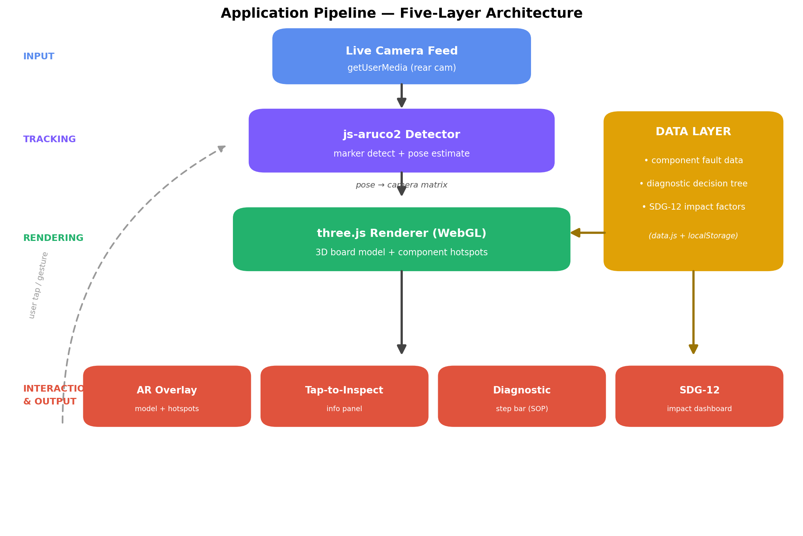

# AR PCB Repair Assistant — WebAR (SDG 12)

A browser-based Augmented Reality tool that overlays interactive repair guidance onto a
physical Raspberry Pi circuit board. It supports **SDG 12.5** (responsible consumption) by
helping people **repair boards instead of discarding them**, reducing e-waste.

No installation — it runs in the phone browser. Marker-based tracking (ArUco) keeps the
overlay aligned to the board.

---

## How to run

The camera requires a **secure context** (HTTPS or `localhost`). Two ways:

### A. Locally (for testing)
```bash
# from this webapp/ folder, any static server works, e.g.:
npx serve .
# then open the shown http://localhost:PORT on the SAME machine,
# or use your phone with a tunnel (e.g. ngrok) for camera access.
```

### B. Deploy to GitHub Pages (recommended)
```bash
git init
git add .
git commit -m "AR PCB Repair Assistant"
git branch -M main
git remote add origin https://github.com/<you>/<repo>.git
git push -u origin main
# GitHub -> Settings -> Pages -> Source: main / root
```
Open `https://<you>.github.io/<repo>/` on your phone.

---

## Set up the marker

The app uses the **ARUCO** dictionary (1024 unique ids → up to 1024 boards).
Each board uses one id; the prototype's Raspberry Pi is **id 100** (a second
balanced marker, **id 23**, maps to the same board so the two can be compared).

> **Marker choice matters.** Use a feature-rich, balanced id (mixed black/white
> cells) such as 100 or 23. Low ids like 0 render as a near-solid-black square and
> detect poorly.

1. Print **`marker_id100_PRINT.svg`** (and/or `marker_id23_PRINT.svg`). These have a
   built-in **white quiet zone** — the white border is how the detector finds the marker.
2. Generate more ids in the project root: `node generate_marker.js <id>` → `marker_id<id>.svg`.
3. Print on paper (not a screen), **solid ink**, keep it **flat** (glue to card if needed),
   keep the **white border** (don't cut into the black), good even light, no glare.
   Size sets the scan distance — small marker = scan close, bigger = scan from further.

---

## Using the app

1. Open the app link, tap **Start**, allow the camera.
2. Point at the board with the marker in view → wait for **Board locked** (readout shows `locked id: 100`).
3. **Tap a red component point** to see its fault, expected/measured values, and the step-by-step checks.
4. Tap **🔧 Diagnose** → pick a problem from the list → confirm the symptom → step through each
   check (**Done — next**) to the fix → **✓ Mark repaired**.
5. Drag with **one finger** to rotate the model, **two fingers** to zoom.
6. Open the **⚙️ settings** menu for the impact dashboard, schematic, and board-library editor.

---

## Project structure
```
webapp/
├── index.html         UI structure + library includes
├── css/styles.css     styling
├── js/
│   ├── data.js        DEFAULT board library (edit or use the in-app editor)
│   ├── library.js     board CRUD · localStorage · JSON/CSV export · import
│   ├── diagnostic.js  builds the per-component diagnosis wizard from a board
│   ├── state.js       shared current-board + counters
│   ├── ar-core.js     three.js scene + render loop
│   ├── ar-model.js    GLB load · rotate/zoom
│   ├── ar-hotspots.js component markers + tap hit-test
│   ├── ar-tracking.js camera + ArUco detect + id-lock + corner/pose smoothing
│   ├── ar-controls.js touch input (rotate/zoom/tap)
│   ├── ui-info.js     component info panel (fault + scrollable steps)
│   ├── ui-sop.js      Diagnose problem list + interactive question wizard
│   ├── ui-dashboard.js impact dashboard + telemetry
│   ├── ui-editor.js   board-library editor (📝)
│   └── main.js        wiring / entry point
├── assets/3d/pcb.glb            3D board model (Draco + WebP, ~1 MB)
├── assets/docs/*.pdf            board schematics
├── marker_id100_PRINT.svg / marker_id23_PRINT.svg  printable ArUco markers (ARUCO, with quiet zone)
└── README.md
```

## Architecture



*Five-layer pipeline: the live camera feed (input) is analysed by the js-aruco2 detector (tracking), whose marker pose becomes a camera matrix used by three.js to render the 3D board model and component hotspots (rendering). A data layer supplies the component fault data, diagnostic decision tree and impact factors, feeding the interaction & output layer — the AR overlay, tap-to-inspect panel, diagnostic step bar and SDG-12 impact dashboard.*

## How it works (technical)
- **Tracking:** `js-aruco2` detects the ARUCO marker each frame and returns its corners.
- **Stability:** the marker **id is locked** (transient misreads ignored) and the **corners are smoothed**
  before pose estimation, so the overlay stays anchored without jitter; only a registered id can lock.
- **Pose:** `POS.Posit` turns the smoothed corners into a 3D rotation + translation; the group is eased onto it.
- **Render:** `three.js` places the board model + component hotspots at that pose.
- **Diagnosis:** tapping a point opens that component's fault + steps; the **🔧 Diagnose** wizard walks
  one problem's checks step by step to the fix.
- **Education:** the intro + impact dashboard quantify the SDG-12 benefit.

## Adding / editing a board (no coding)
The board library is a bundled JSON (`js/data.js`) plus your edits saved in the browser. Use the **📝 editor**:

1. Put the model in `assets/3d/` and the schematic in `assets/docs/`.
   (Static hosting cannot upload files — they must be committed with git.)
2. In **📝**: click **+ Board**, enter the **ArUco marker id** and name.
3. Fill **GLB path** and **Schematic path**, click **Save board info**.
   (Use **Preview GLB file** to test a model in the current session.)
4. Add each faulty part with **+ Add component** (id, name, fault, expected,
   measured, and the **fix** = the repair method). Set its position by editing
   **x / y / z** or with the **📍 Place** tool (tap the real part on screen).
   Use **📋 Copy positions** to copy coordinates for baking into `data.js`.
5. Print the marker for that id: `node generate_marker.js <id>` (in the project root).
6. **⬇ JSON** to back up / share the library, **⬇ CSV** for a spreadsheet view.
   **⬆ Import JSON** restores a saved library. **Reset** returns to bundled defaults.

To make new boards permanent for everyone, paste the exported JSON into `js/data.js`
(as `window.DEFAULT_BOARDS`) and commit, or keep distributing the JSON via Import.

## Hosting board files
Keep `.glb` and schematics in this repo's `assets/` (reliable, CORS-safe, free).
Google Drive is **not** recommended for the GLB (CORS + scan interstitial break loading).
If you must host externally, use a CORS-friendly URL (e.g. jsDelivr over your GitHub repo)
and paste it into the GLB/Schematic path field.

## Libraries
- [js-aruco2](https://github.com/damianofalcioni/js-aruco2) — marker detection + pose
- [three.js](https://threejs.org/) — WebGL 3D rendering
- [Draco](https://google.github.io/draco/) / [glTF-Transform](https://gltf-transform.dev/) — model compression
